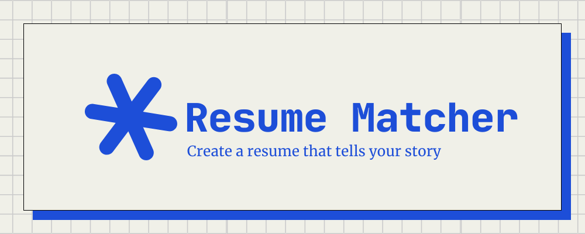
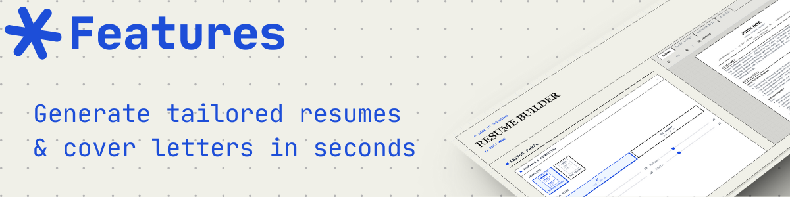
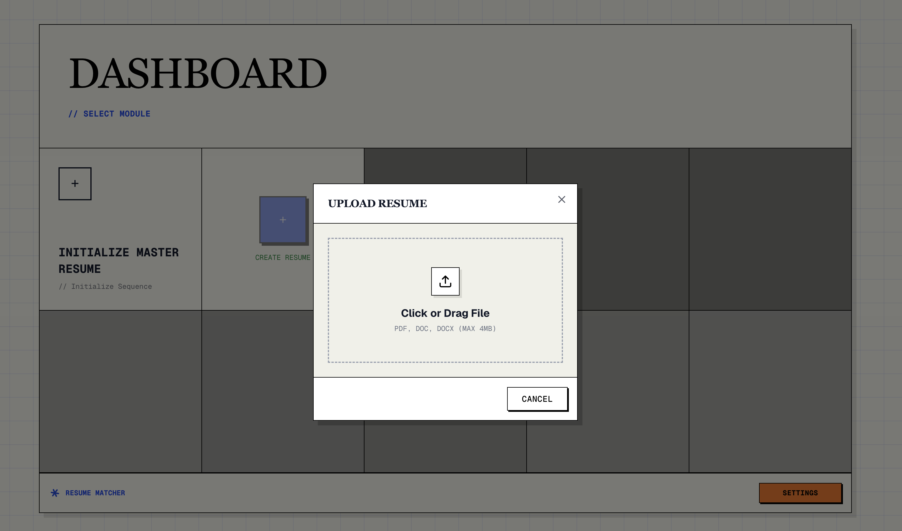
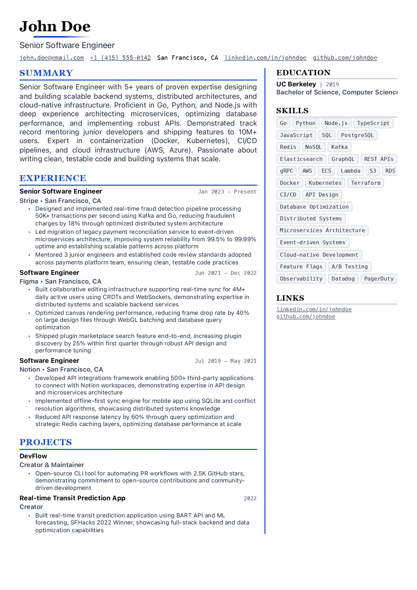

<div align="center">

[](https://www.resumematcher.fyi)

# Resume Matcher

[�𝚎𝚋𝚜𝚒𝚝𝚎](https://resumematcher.fyi) ✦ [𝙷𝚘𝚠 𝚝𝚘 𝙸𝚗𝚜𝚝𝚊𝚕𝚕](https://resumematcher.fyi/docs/installation)

**English** | [Español](README.es.md) | [简体中文](README.zh-CN.md) | [日本語](README.ja.md)

Create tailored resumes for each job application with AI-powered suggestions. Works locally with Ollama or connect to your favorite LLM provider via API.


</div>

<br>

<div align="center">


[](https://resumematcher.fyi)

</div>

> \[!IMPORTANT]
>
> This project is in active development. New features are being added continuously, and we welcome contributions from the community. If you have any suggestions or feature requests, please feel free to open an issue on GitHub or discuss it on our [Discord](https://dsc.gg/resume-matcher) server.

## Getting Started

Resume Matcher works by creating a master resume that you can use to tailor for each job application. Installation instructions here: [How to Install](#how-to-install)

### How It Works

1. **Upload** your master resume (PDF or DOCX)
2. **Paste** a job description you're targeting
3. **Review** AI-generated improvements and tailored content
4. **Cover Letter** generator for the job application
5. **Customize** the layout and sections to fit your style
6. **Export** as a professional PDF with your preferred template


- Twitter: [https://twitter.com/srbhrai](https://twitter.com/srbhrai)
- GitHub: [https://github.com/srbhr](https://github.com/srbhr)

## Key Features



### Core Features

**Master Resume**: Create a comprehensive master resume to draw from your existing one.



### Resume Builder


Paste in a job description and get AI-powered resume tailored for that specific role.

You can:

- Modify suggested content
- Add/remove sections
- Rearrange sections via drag-and-drop
- Choose from multiple resume templates

### Cover Letter Generator

Generate tailored cover letters based on the job description and your resume.


### Resume Scoring & Keyword Highlighting

Analyze your resume against the job description with a match score, keyword highlighting, and suggestions for improvement.


### PDF Export

Export your tailored resume and cover letter in PDF.

### Templates

| Template Name | Preview | Description |
|---------------|---------|-------------|
| **Classic Single Column** |  | A traditional and clean layout suitable for most industries. [𝐕𝐢𝐞𝐰 𝐏𝐃𝐅](assets/pdf-templates/single-column.pdf) |
| **Modern Single Column** |  | A contemporary design with a focus on readability and aesthetics. [𝐕𝐢𝐞𝐰 𝐏𝐃𝐅](assets/pdf-templates/modern-single-column.pdf)|
| **Classic Two Column** |  | A structured layout that separates sections for clarity. [𝐕𝐢𝐞𝐰 𝐏𝐃𝐅](assets/pdf-templates/two-column.pdf)|
| **Modern Two Column** |  | A sleek design that utilizes two columns for better organization. [𝐕𝐢𝐞𝐰 𝐏𝐃𝐅](assets/pdf-templates/modern-two-column.pdf)|

### Internationalization

- **Multi-Language UI**: Interface available in English, Spanish, Chinese, Japanese, and Portuguese (Brazilian)
- **Multi-Language Content**: Generate resumes and cover letters in your preferred language

### Roadmap

If you have any suggestions or feature requests, please feel free to open an issue on GitHub or discuss it on our [Discord](https://dsc.gg/resume-matcher) server.

- AI Canvas for crafting impactful, metric-driven resume content
- Email template generator for job applications
- Multi-job description optimization

<a id="how-to-install"></a>

## How to Install


For detailed setup instructions, see **[SETUP.md](SETUP.md)** (English) or: [Español](SETUP.es.md), [简体中文](SETUP.zh-CN.md), [日本語](SETUP.ja.md).

### Prerequisites

| Tool | Version | Installation |
|------|---------|--------------|
| Python | 3.13+ | [python.org](https://python.org) |
| Node.js | 22+ | [nodejs.org](https://nodejs.org) |
| uv | Latest | [astral.sh/uv](https://docs.astral.sh/uv/getting-started/installation/) |

### Quick Start

Fastest for MacOS, WSL and Ubuntu users:

```bash
# Clone the repository
git clone https://github.com/srbhr/Resume-Matcher.git
cd Resume-Matcher

# Backend (Terminal 1)
cd apps/backend
cp .env.example .env        # Configure your AI provider
uv sync                      # Install dependencies
uv run app

# Frontend (Terminal 2)
cd apps/frontend
npm install
npm run dev
```

Open **<http://localhost:3000>** and configure your AI provider in Settings.

### Supported AI Providers

| Provider | Local/Cloud | Notes |
|----------|-------------|-------|
| **Ollama** | Local | Free, runs on your machine |
| **OpenAI** | Cloud | GPT-5 Nano, GPT-4o |
| **Anthropic** | Cloud | Claude Haiku 4.5 |
| **Google Gemini** | Cloud | Gemini 3 Flash |
| **OpenRouter** | Cloud | Access to multiple models |
| **DeepSeek** | Cloud | DeepSeek Chat |

### Docker Deployment

Official Docker images are published for `linux/amd64` and `linux/arm64` on:

- `ghcr.io/hafsa572/resume-matcher`

Run on a single public port (`3000`) with API available at `/api`:

```bash
docker run --name resume-matcher \
  -p 3000:3000 \
  -v resume-data:/app/backend/data \
  ghcr.io/hafsa572/resume-matcher:latest
```

Prefer pinning a version in production, for example `ghcr.io/hafsa572/resume-matcher:1.2.0` or
`ghcr.io/hafsa572/resume-matcher:1.2`.

Endpoints:

- App: <http://localhost:3000>
- API health check: <http://localhost:3000/api/v1/health>
- API docs: <http://localhost:3000/docs>

> **Using Ollama with Docker?** Use `http://host.docker.internal:11434` as the Ollama URL instead of `localhost`.

### Tech Stack

| Component | Technology |
|-----------|------------|
| Backend | FastAPI, Python 3.13+, LiteLLM |
| Frontend | Next.js 16, React 19, TypeScript |
| Database | TinyDB (JSON file storage) |
| Styling | Tailwind CSS 4, Swiss International Style |
| PDF | Headless Chromium via Playwright |

## Join Us and Contribute


We welcome contributions from everyone! Whether you're a developer, designer, or just someone who wants to help out.

Check out the roadmap if you would like to work on the features that are planned for the future. If you have any suggestions or feature requests, please feel free to open an issue on GitHub.


